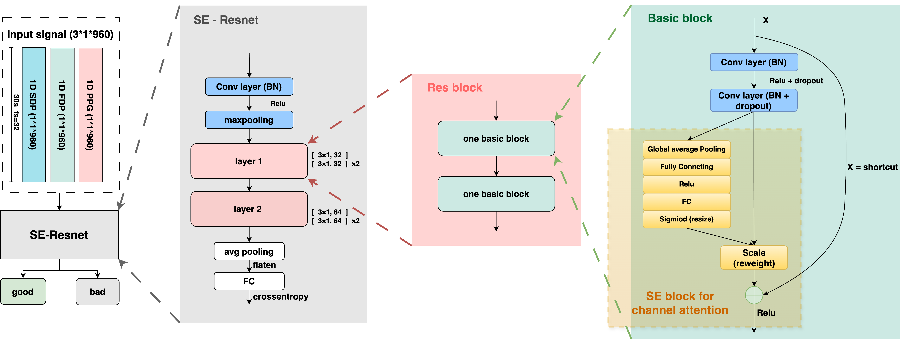

# Lightweight ResNet-Based Deep Learning for Photoplethysmography Signal Quality Assessment

### Overview

📌 **1.** This repository contains the implementation of a lightweight ResNet-based deep learning model integrated with Squeeze-and-Excitation (SE) blocks.  
📌 **2.** The model is optimized for photoplethysmography (PPG) signal quality assessment to classify signals into "good" or "bad" quality, enabling enhanced signal processing.

---
### Model Architecture

